## Erick Silva | Data Analyst | Analytics Engineer | Data Engineer

Sou um profissional focado em Dados, Negócios e Estratégia, com experiência em transformar dados em decisões que geram impacto real. Atuo com análise de dados, engenharia de dados e inteligência de negócios, sempre buscando eficiência, escalabilidade e geração de valor.

Tenho experiência na construção de pipelines de dados utilizando Python, DBT, SQL, Airflow e AWS, além de desenvolver análises estratégicas envolvendo métricas e indicadores. Também trabalho com visualização de dados (Power BI, Metabase, Looker e Streamlit) e apoio direto na tomada de decisão em ambientes dinâmicos.

Gosto de resolver problemas complexos, otimizar processos e construir soluções orientadas a dados. Atualmente, também atuo com metodologias ágeis, facilitando a organização e entrega de times técnicos.

🚀 Sempre aprendendo, construindo e evoluindo no ecossistema de dados.

##

  <table border="0">
    <tr>
      <td>
        
      </td>
      <td>
        
      </td>
    </tr>
  </table>

  
  
  
  
  
  
  
  
  
   
   
  

##

 
  
  
   

          
